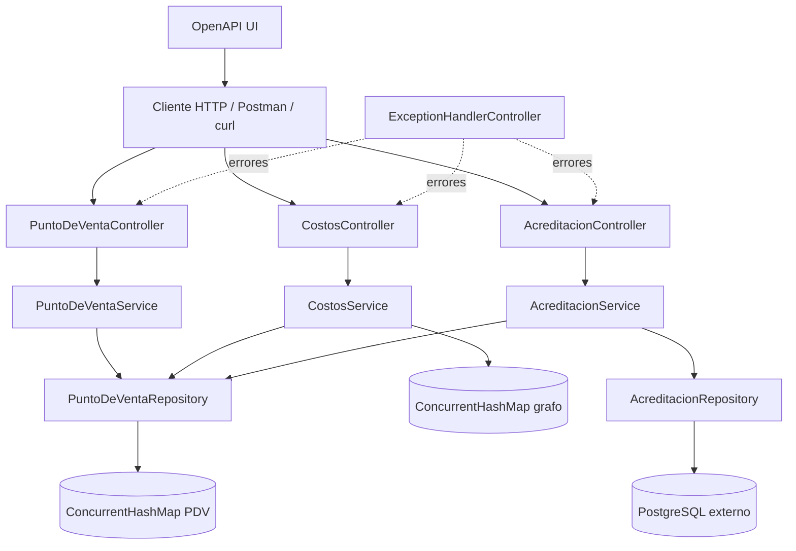
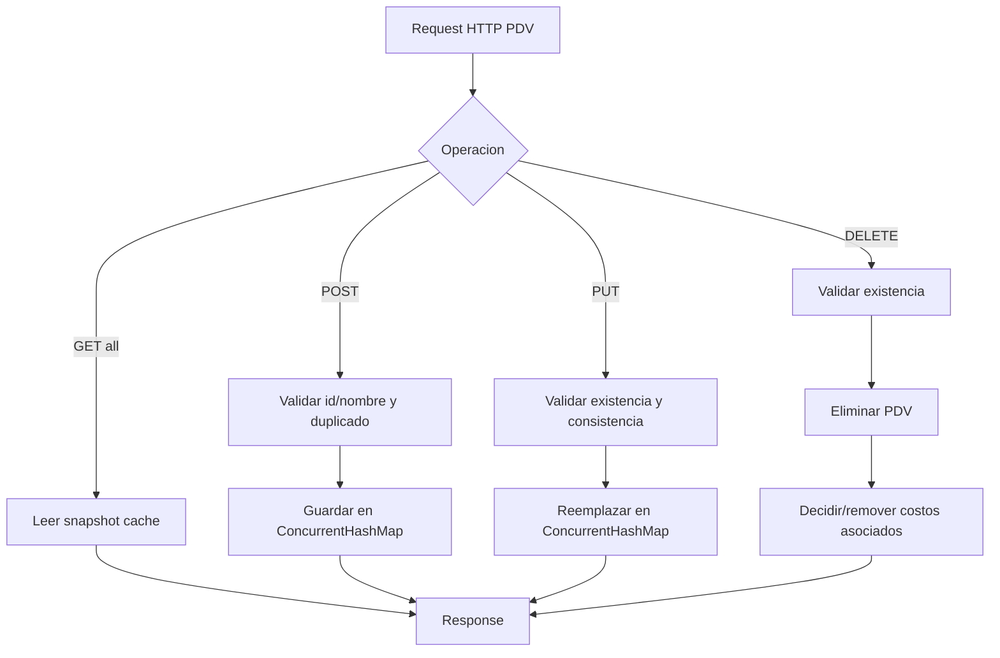
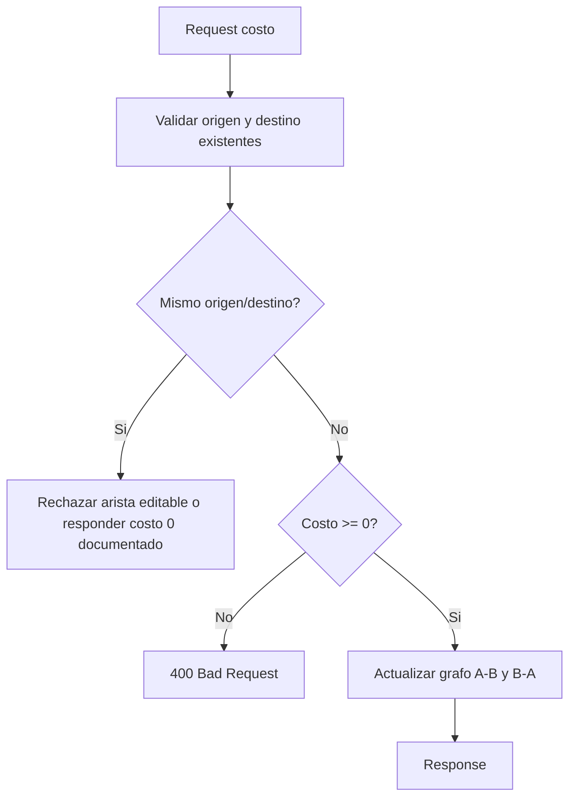
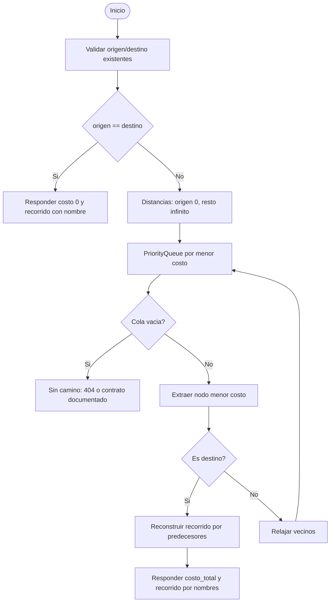
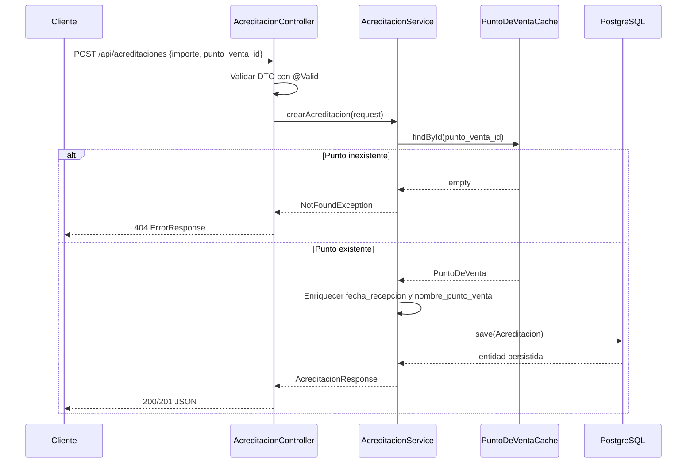

# Design - Accenture Challenge Java 2025

## Objetivo de diseño

Completar la solución preservando la arquitectura actual Spring Controller -> Service -> Repository/Cache, reforzando concurrencia, validaciones, pruebas y documentación sin reescribir innecesariamente el proyecto.

## Arquitectura propuesta

## Componentes

### API HTTP

- `PuntoDeVentaController`: endpoints CRUD del cache de puntos de venta.
- `CostosController`: endpoints para cargar/remover costos, consultar vecinos y camino mínimo.
- `AcreditacionController`: endpoints para registrar y listar acreditaciones.
- `ExceptionHandlerController`: contrato único para errores 400, 404 y 500.

### Dominio y servicios

- `PuntoDeVentaService` recomendado: encapsular validaciones de existencia, duplicados, consistencia path/body y efectos colaterales al borrar.
- `CostosService`: mantener Dijkstra y consulta de vecinos; agregar validación de puntos existentes y casos borde.
- `AcreditacionService`: enriquecer con fecha y nombre de PDV; persistir mediante JPA.

### Persistencia y caches

- Puntos de venta: `ConcurrentHashMap<Integer, PuntoDeVenta>` y respuestas con copias inmutables (`List.copyOf`) para evitar vistas mutables del mapa.
- Costos: grafo no dirigido con `ConcurrentHashMap<Integer, ConcurrentHashMap<Integer, Integer>>`; las actualizaciones deben mantener simetría.
- Acreditaciones: PostgreSQL externo mediante `AcreditacionRepository`.

## Flujos principales

### CRUD de puntos de venta

### Costos directos y vecinos

### Camino mínimo

### Acreditaciones

## Contratos HTTP recomendados

| Caso | Método y path actual/propuesto | Respuesta exitosa | Errores esperados |
| --- | --- | --- | --- |
| Listar PDV | `GET /api/pdv` | 200 + lista | 500 |
| Crear PDV | `POST /api/pdv` | 201 + recurso o location | 400, 409 |
| Actualizar PDV | `PUT /api/pdv/{id}` | 200/204 | 400, 404 |
| Borrar PDV | `DELETE /api/pdv/{id}` | 204 | 404 |
| Crear costo | `POST /api/costos` | 200/201 | 400, 404 |
| Remover costo | `DELETE /api/costos/{origen}/{destino}` | 204 | 404 opcional |
| Vecinos | `GET /api/costos/{origen}` | 200 + vecinos | 404 |
| Camino mínimo | `GET /api/costos/camino/{origen}/{destino}` | 200 + costo/recorrido | 404 para PDV o camino inexistente |
| Crear acreditación | `POST /api/acreditaciones` | 201/200 + acreditación | 400, 404 |
| Listar acreditaciones | `GET /api/acreditaciones` | 200 + lista | 500 |

## Decisiones técnicas a cerrar

1. Mantener Spring Boot 4.0.0 o bajar a una versión estable ampliamente soportada si hay problemas de compatibilidad con librerías.
2. Elegir contrato para camino inalcanzable: 404 recomendado para API REST, o conservar `costo_total=-1` documentándolo.
3. Elegir comportamiento al borrar PDV: remover costos asociados recomendado para consistencia del grafo; no tocar acreditaciones históricas.
4. Cambiar `ddl-auto=create-drop` a un valor seguro para ejecución demo (`update` o migraciones) y usar variables de entorno.
5. Agregar JaCoCo para medir cobertura y poder adjuntar reporte.

## Patrones y utilidades modernas a documentar

- Capas Controller/Service/Repository.
- Repository pattern para JPA y cache de puntos de venta.
- DTOs inmutables con Java records.
- Builder pattern en entidad `Acreditacion` vía Lombok.
- Algoritmo Dijkstra con `PriorityQueue`.
- Streams y `toList()` para mapeos.
- `var` para inferencia local.
