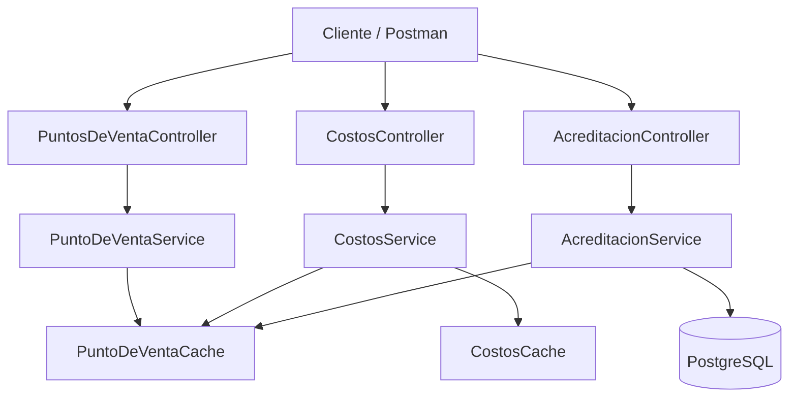
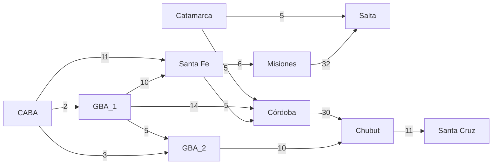
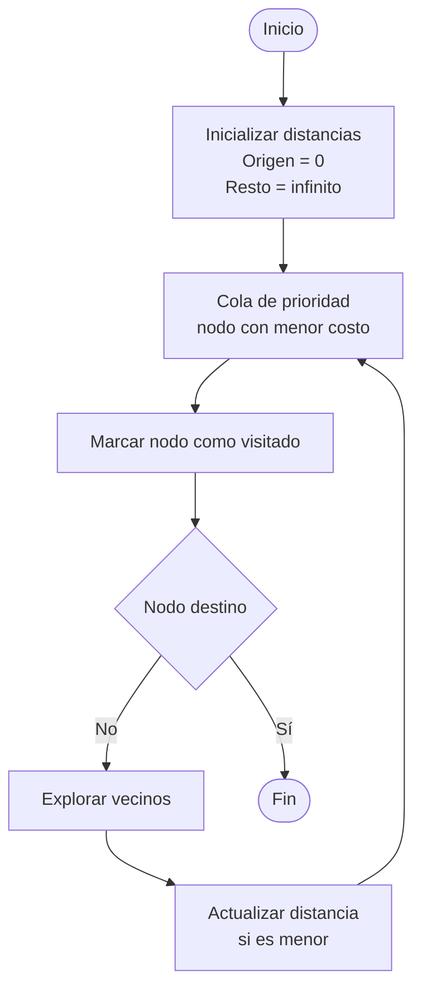
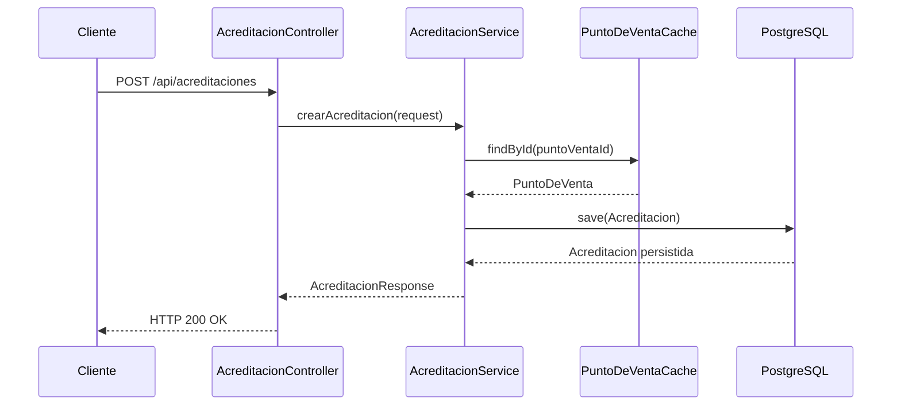

# Challenge 2025 – Backend Java

Este proyecto corresponde al **Challenge Técnico Backend 2025**, desarrollado en **Java 21** utilizando **Spring Boot**, con el objetivo de demostrar conocimientos en:

- APIs REST
- Diseño de microservicios
- Caché en memoria
- Persistencia con JPA
- Algoritmos (camino mínimo – Dijkstra)
- Manejo de errores
- Testing unitario
- Buenas prácticas de diseño (SOLID)

---

## 🧱 Arquitectura general

La aplicación se divide en **tres módulos principales**:

1. **Puntos de Venta**
2. **Costos entre Puntos de Venta**
3. **Acreditaciones**

Cada módulo mantiene responsabilidades claras y se comunica mediante servicios internos.

Acá está un diagrama general de la arquitectura diseñada



---

## 🟦 Módulo 1 – Puntos de Venta

Este módulo expone una API REST que administra un **caché en memoria** de puntos de venta.

### Características
- Almacenamiento en memoria
- Identificación por ID
- Nombre asociado a cada punto de venta
- Operaciones CRUD
- Usado como dependencia por otros módulos

### Ejemplo de endpoint
```text
GET /api/pdv/1
```

### Ejemplo de respuesta
```json
{
    "id": 1,
    "nombre": "CABA"
}
```

---

## 🟩 Módulo 2 – Costos entre Puntos de Venta

Este módulo mantiene un grafo no dirigido en memoria que representa el costo de trasladarse entre puntos de venta.



### Reglas implementadas
- El costo nunca puede ser negativo
- El costo de un punto a sí mismo es 0
- El costo A → B es igual a B → A
- No todos los puntos están conectados
- No existen caminos directos paralelos
- El camino más corto no siempre es el más barato

### Algoritmo
Para calcular el camino de menor costo se implementó el Algoritmo de Dijkstra, garantizando la obtención del costo mínimo acumulado entre dos puntos.



### Ejemplo de endpoint
```text
GET /api/costos/camino/1/4
```

### Ejemplo de respuesta
```json
{
  "costo_total": 11,
  "recorrido": [
    "CABA",
    "Santa Fe"
  ]
}
```

## 🟨 Módulo 3 – Acreditaciones
Este módulo permite registrar **acreditaciones asociadas** a un punto de venta.

### Flujo

- Se recibe una solicitud de acreditación
- Se valida la existencia del punto de venta
- Se enriquece la información:
- Nombre del punto de venta
- Fecha de recepción
- Se persiste la acreditación en PostgreSQL
- Se devuelve la respuesta normalizada



### Ejemplo de endpoint
```text
POST /api/acreditaciones
```
```json
{
  "importe": 1500.75,
  "punto_venta_id": 3
}
```

### Ejemplo de respuesta
```json
{
  "id": 1,
  "importe": 1500.75,
  "punto_venta_id": 3,
  "nombre_punto_venta": "GBA_2",
  "fecha_recepcion": "2025-13-12 22:10:10.000"
}
```