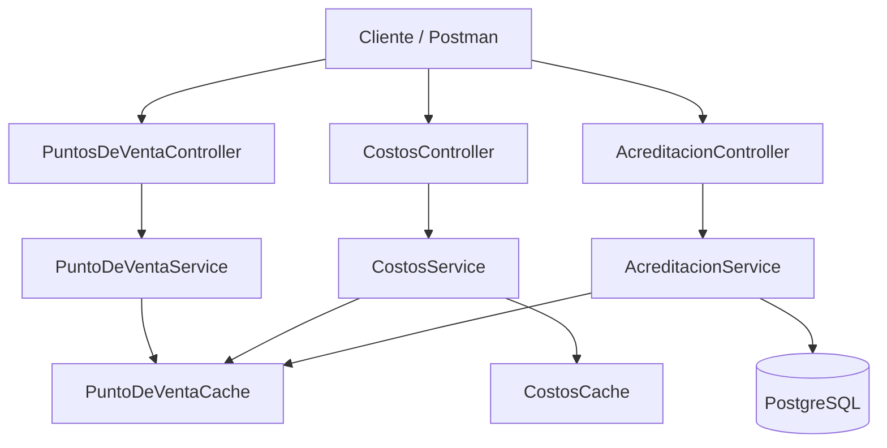
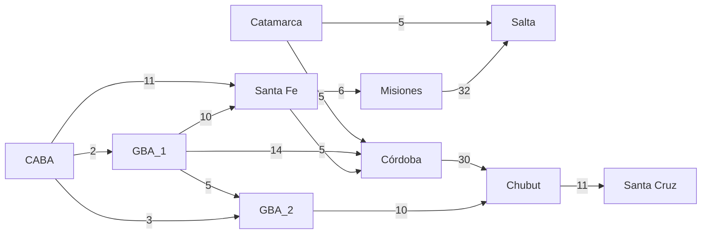
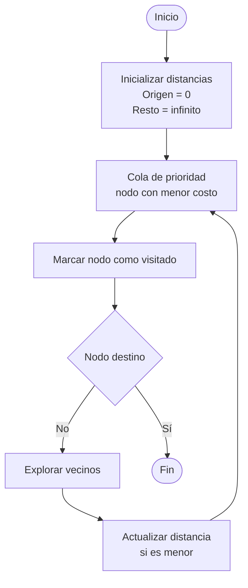
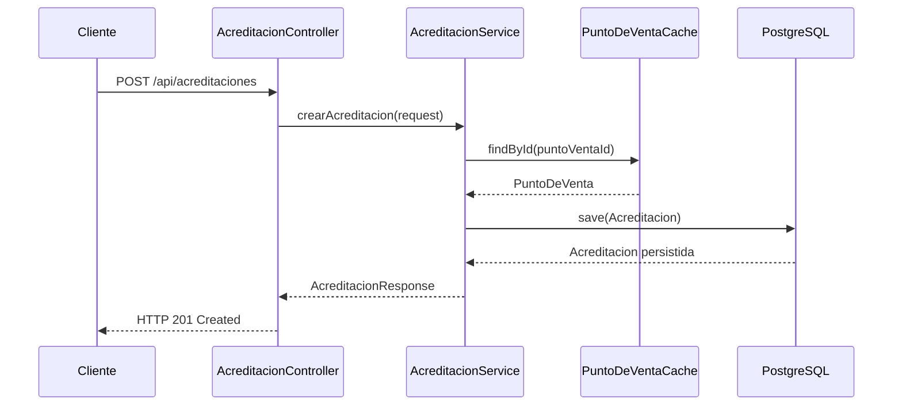

# Challenge 2025 – Backend Java

Este proyecto corresponde al **Challenge Técnico Backend 2025**, desarrollado en **Java 21** utilizando **Spring Boot**, con el objetivo de demostrar conocimientos en:

- APIs REST
- Diseño de microservicios
- Caché en memoria
- Persistencia con JPA
- Algoritmos (camino mínimo – Dijkstra)
- Manejo de errores
- Testing unitario
- Buenas prácticas de diseño (SOLID)

---

## 🧱 Arquitectura general

La aplicación se divide en **tres módulos principales**:

1. **Puntos de Venta**
2. **Costos entre Puntos de Venta**
3. **Acreditaciones**

Cada módulo mantiene responsabilidades claras y se comunica mediante servicios internos.

Acá está un diagrama general de la arquitectura diseñada


```mermaid
flowchart TD
    Client[Cliente / Postman]

    Client --> PVController[PuntosDeVentaController]
    Client --> CostosController[CostosController]
    Client --> AcredController[AcreditacionController]

    PVController --> PVService[PuntoDeVentaService]
    PVService --> PVCache[PuntoDeVentaCache]

    CostosController --> CostosService
    CostosService --> CostosCache
    CostosService --> PVCache

    AcredController --> AcredService[AcreditacionService]
    AcredService --> PVCache
    AcredService --> AcredRepo[(PostgreSQL)]
```

---

## 🟦 Módulo 1 – Puntos de Venta

Este módulo expone una API REST que administra un **caché en memoria** de puntos de venta.

### Características
- Almacenamiento en memoria
- Identificación por ID
- Nombre asociado a cada punto de venta
- Operaciones CRUD
- Usado como dependencia por otros módulos

### Ejemplo de endpoint
```text
GET /api/pdv/1
```

### Ejemplo de respuesta
```json
{
    "id": 1,
    "nombre": "CABA"
}
```

---

## ⚙️ Build y ejecución

### Requisitos

- Java 21 para ejecución local.
- Maven 3.9+ o el wrapper del proyecto.
- PostgreSQL externo para el módulo de acreditaciones.
- Podman/Podman Compose o Docker/Docker Compose para levantar la aplicación en contenedores.

> En esta solución se documenta Podman como alternativa compatible OCI a Docker, útil cuando Docker Desktop no está disponible en el host.
> Para usar `podman compose`, el host debe tener disponible un proveedor de Compose, por ejemplo `podman-compose` o Docker Compose compatible.

### Ejecutar tests

```bash
./mvnw.cmd test
```

En Linux/macOS:

```bash
./mvnw test
```

### Compilar JAR

```bash
./mvnw.cmd clean package
```

El artefacto queda en:

```text
target/challenge-2025-0.0.1-SNAPSHOT.jar
```

### Configuración local

La aplicación usa variables de entorno con defaults para demo:

```text
SPRING_DATASOURCE_URL=jdbc:postgresql://localhost:5432/accenture_challenge_2025_db
SPRING_DATASOURCE_USERNAME=postgres
SPRING_DATASOURCE_PASSWORD=postgres
SPRING_JPA_HIBERNATE_DDL_AUTO=update
```

> Los defaults asumen la misma configuración que el `docker-compose.yml`. Si tu PostgreSQL nativo usa otra contraseña, créala con:
> ```powershell
> $env:SPRING_DATASOURCE_PASSWORD="tu_password"
> ```
> o pásala inline al ejecutar:
> ```powershell
> $env:SPRING_DATASOURCE_PASSWORD="admin23112017"; .\mvnw.cmd spring-boot:run
> ```

Para ejecutar localmente con una base PostgreSQL ya levantada:

```bash
.\mvnw.cmd spring-boot:run
```

### Ejecución con Podman

Desde la raíz del repositorio:

```bash
podman compose -f docker/docker-compose.yml up --build
```

Si el host usa `podman-compose`:

```bash
podman-compose -f docker/docker-compose.yml up --build
```

> ⚠️ Si el contenedor de PostgreSQL ya se ejecutó antes y persiste un volumen con datos, puede haber conflictos de contraseña. Para empezar desde cero:
> ```bash
> podman compose -f docker/docker-compose.yml down -v
> podman compose -f docker/docker-compose.yml up --build
> ```
> La opción `-v` elimina el volumen `postgres_data`, forzando una inicialización limpia.

### Ejecución con Docker

```bash
docker compose -f docker/docker-compose.yml up --build
```

> ⚠️ Misma recomendación: usar `down -v` si hay volúmenes persistentes previos.

La API queda publicada en:

```text
http://localhost:8080
```

PostgreSQL queda publicado en:

```text
localhost:5432
```

Variables soportadas por el compose:

```text
POSTGRES_DB=accenture_challenge_2025_db
POSTGRES_USER=postgres
POSTGRES_PASSWORD=postgres
SPRING_JPA_HIBERNATE_DDL_AUTO=update
```

### Probar rápidamente

La API tiene autenticación HTTP Basic configurada (usuario: `admin`, contraseña: `admin123`). Todos los ejemplos la incluyen para compatibilidad.

#### Puntos de venta (`/api/pdv`)

```bash
# Listar todos
curl -u admin:admin123 http://localhost:8080/api/pdv

# Obtener uno
curl -u admin:admin123 http://localhost:8080/api/pdv/1

# Crear
curl -X POST http://localhost:8080/api/pdv \
  -u admin:admin123 \
  -H "Content-Type: application/json" \
  -d '{"id":11,"nombre":"Tucumán"}'

# Actualizar
curl -X PUT http://localhost:8080/api/pdv/11 \
  -u admin:admin123 \
  -H "Content-Type: application/json" \
  -d '{"id":11,"nombre":"Tucumán Actualizado"}'

# Eliminar
curl -X DELETE http://localhost:8080/api/pdv/11 -u admin:admin123
```

#### Costos (`/api/costos`)

```bash
# Agregar/actualizar costo directo
curl -X POST http://localhost:8080/api/costos \
  -u admin:admin123 \
  -H "Content-Type: application/json" \
  -d '{"origen":1,"destino":4,"costo":15}'

# Ver vecinos de un punto
curl -u admin:admin123 http://localhost:8080/api/costos/1

# Camino mínimo entre dos puntos
curl -u admin:admin123 http://localhost:8080/api/costos/camino/1/4

# Eliminar costo directo
curl -X DELETE http://localhost:8080/api/costos/1/4 -u admin:admin123
```

#### Acreditaciones (`/api/acreditaciones`) — con PostgreSQL

```bash
# Crear una acreditación (el campo JSON es "punto_venta_id")
curl -X POST http://localhost:8080/api/acreditaciones \
  -u admin:admin123 \
  -H "Content-Type: application/json" \
  -d '{"importe":250.75,"punto_venta_id":1}'

# Listar todas las acreditaciones
curl -u admin:admin123 http://localhost:8080/api/acreditaciones
```

> **⚠️ Para Windows/PowerShell:** Si usas `curl.exe` desde PowerShell, el quoting del JSON puede fallar. La forma más fiable es escribir el JSON a un archivo temporal:
> ```powershell
> Set-Content -Path "$env:TEMP\acred.json" -Value '{"importe": 250.75, "punto_venta_id": 1}' -Encoding Ascii
> curl.exe -s -X POST http://localhost:8080/api/acreditaciones -u admin:admin123 -H "Content-Type: application/json" -d "@$env:TEMP\acred.json"
> ```

---

## 🟩 Módulo 2 – Costos entre Puntos de Venta

Este módulo mantiene un grafo no dirigido en memoria que representa el costo de trasladarse entre puntos de venta.


```mermaid
graph LR
    A[CABA]
    B[GBA_1]
    C[GBA_2]
    D[Santa Fe]
    E[Córdoba]
    F[Misiones]
    G[Salta]
    H[Chubut]
    I[Santa Cruz]
    J[Catamarca]

    A -- 2 --> B
    A -- 3 --> C
    B -- 5 --> C
    B -- 10 --> D
    A -- 11 --> D
    D -- 5 --> E
    B -- 14 --> E
    F -- 32 --> G
    H -- 11 --> I
    J -- 5 --> G
    C -- 10 --> H
    E -- 30 --> H
    J -- 5 --> E
    D -- 6 --> F
```

### Reglas implementadas
- El costo nunca puede ser negativo
- El costo de un punto a sí mismo es 0
- El costo A → B es igual a B → A
- No todos los puntos están conectados
- No existen caminos directos paralelos
- El camino más corto no siempre es el más barato

### Algoritmo
Para calcular el camino de menor costo se implementó el Algoritmo de Dijkstra, garantizando la obtención del costo mínimo acumulado entre dos puntos.


```mermaid
flowchart TD
    Start([Inicio])
    Init[Inicializar distancias\nOrigen = 0\nResto = infinito]
    PQ[Cola de prioridad\nnodo con menor costo]
    Visit[Marcar nodo como visitado]
    Check{Nodo destino}
Explore[Explorar vecinos]
Update[Actualizar distancia\nsi es menor]
End([Fin])

Start --> Init
Init --> PQ
PQ --> Visit
Visit --> Check
Check -- Sí --> End
Check -- No --> Explore
Explore --> Update
Update --> PQ
```

### Ejemplo de endpoint
```text
GET /api/costos/camino/1/4
```

### Ejemplo de respuesta
```json
{
  "costo_total": 11,
  "recorrido": [
    "CABA",
    "Santa Fe"
  ]
}
```

## 🟨 Módulo 3 – Acreditaciones
Este módulo permite registrar **acreditaciones asociadas** a un punto de venta.

### Flujo

- Se recibe una solicitud de acreditación
- Se valida la existencia del punto de venta
- Se enriquece la información:
- Nombre del punto de venta
- Fecha de recepción
- Se persiste la acreditación en PostgreSQL
- Se devuelve la respuesta normalizada


```mermaid
sequenceDiagram
    participant Cliente
    participant Controller as AcreditacionController
    participant Service as AcreditacionService
    participant Cache as PuntoDeVentaCache
    participant DB as PostgreSQL

    Cliente->>Controller: POST /api/acreditaciones
    Controller->>Service: crearAcreditacion(request)

    Service->>Cache: findById(puntoVentaId)
    Cache-->>Service: PuntoDeVenta

    Service->>DB: save(Acreditacion)
    DB-->>Service: Acreditacion persistida

    Service-->>Controller: AcreditacionResponse
    Controller-->>Cliente: HTTP 201 Created
```

### Ejemplo de endpoint
```text
POST /api/acreditaciones
```
```json
{
  "importe": 1500.75,
  "punto_venta_id": 3
}
```

### Ejemplo de respuesta
```json
{
  "id": 1,
  "importe": 1500.75,
  "punto_venta_id": 3,
  "nombre_punto_venta": "GBA_2",
  "fecha_recepcion": "2025-12-13T22:10:10"
 }
 ```

---

## 🧠 Utilidades modernas de Java usadas

| Utilidad | Versión Java | Dónde se usa |
|---|---|---|
| **Records** (`record`) | 16 (estable en 14 como preview) | DTOs: `PuntoDeVenta`, `AcreditacionesRequest`, `AcreditacionResponse`, `CostoRequest`, `CostosOrigenResponse`, `Vecino`, `CaminoMinimoResponse`, `Costo` |
| **`var`** (inferencia de tipo local) | 10 | En todos los servicios, controllers y tests para reducir verbosidad |
| **Streams API** | 8 | Mapeo de entidades a DTOs y filtros en servicios |
| **`toList()`** en streams | 16 | Reemplazo de `collect(Collectors.toList())` en `AcreditacionService` y `CostosService` |
| **`List.copyOf()`** | 10 | Snapshot inmutable en `PuntoDeVentaCache.getAll()` |
| **`ConcurrentHashMap`** | 5 | Caches thread-safe en `PuntoDeVentaCache` y `CostosCache` |
| **`PriorityQueue`** con `Comparator` | 5 | Algoritmo de Dijkstra en `CostosService` |
| **`LocalDateTime`** | 8 | Timestamp de recepción de acreditaciones |
| **Anotaciones `@Builder`, `@Data` (Lombok)** | — | Entidad `Acreditacion` para reducir boilerplate |
| **Jakarta Validation** | — | Validación de request DTOs con `@NotNull`, `@DecimalMin`, `@Valid` |
| **`@ControllerAdvice`** | — | Manejo global de excepciones en `ExceptionHandlerController` |

## 🏛️ Patrones de diseño aplicados

| Patrón | Dónde se aplica |
|---|---|
| **Controller → Service → Repository** | Separación en 3 capas para cada módulo (puntos de venta, costos, acreditaciones) |
| **Repository** | `PuntoDeVentaRepository` como interfaz abstrae el cache; `AcreditacionRepository` extiende `JpaRepository` |
| **DTO (Data Transfer Object)** | Records inmutables para request/response en todos los endpoints |
| **Builder** | `Acreditacion.builder()` de Lombok para construcción de entidades |
| **Dependency Injection** | `@RequiredArgsConstructor` + constructor injection en todos los services y controllers |
| **Strategy** | Algoritmo de Dijkstra encapsulado en `CostosService` como estrategia de camino mínimo |
| **Singleton** | Beans de Spring (`@Component`, `@Service`, `@Controller`) son singletons por defecto |
| **Exception Handler / Controller Advice** | `ExceptionHandlerController` centraliza errores HTTP 400, 404 y 500 |
| **Chain of Responsibility / Interceptor** | Filtro de seguridad de Spring Security en `SecurityConfig` |

## 📋 Supuestos

1. **Persistencia de caches**: Los caches de puntos de venta y costos residen en memoria y se inicializan al arrancar la aplicación. Se pierden al reiniciar.
2. **Costos directos editables**: Agregar un costo directo entre A y B actualiza o crea una arista única. No se permiten caminos paralelos (el enunciado lo establece).
3. **Costo cero y self-loop**: El costo de un punto hacia sí mismo es 0, pero no se almacena como arista directa editable. La API rechaza intentos de cargar un costo directo de A → A.
4. **Simetría del grafo**: El costo A → B es igual a B → A. La API mantiene esta simetría automáticamente al agregar o remover costos.
5. **Borrado de punto de venta**: Al eliminar un punto de venta se remueven también todas sus aristas salientes y entrantes del grafo de costos. Las acreditaciones históricas con ese ID no se modifican (persisten en PostgreSQL).
6. **Camino inalcanzable**: Si dos puntos de venta no están conectados (directa o indirectamente), la API responde HTTP 404 con un mensaje descriptivo.
7. **Fecha de recepción**: Se almacena en `LocalDateTime` del servidor (JVM local).
8. **Base de datos externa**: La aplicación requiere PostgreSQL externo. No se incluye H2 ni base embebida. Los perfiles de Spring permiten configurar la conexión por variable de entorno.
9. **Seguridad**: La autenticación HTTP Basic está configurada pero actualmente `authorizeHttpRequests` permite todo (`permitAll`). Es responsabilidad del deployer habilitarla según el entorno.
10. **DDL automático**: `spring.jpa.hibernate.ddl-auto` está configurado como `update` por defecto, preservando datos entre reinicios. Cambiar a `create-drop` solo para desarrollo.
11. **Compatibilidad de contenedores**: La solución soporta tanto Podman como Docker. Para `podman compose` se requiere un proveedor de Compose instalado (por ejemplo, `podman-compose` o `docker-compose`).
12. **ID de punto de venta en POST**: Al crear un punto de venta, el cliente provee el ID numérico. No se asigna automáticamente.

## 📦 Reporte de cobertura

La cobertura se mide con JaCoCo durante `verify`:

```bash
./mvnw.cmd clean verify
```

El reporte HTML se genera en:

```text
target/site/jacoco/index.html
```

Los thresholds están configurados para un mínimo de 70% de cobertura de líneas (excluyendo DTOs, entidades, config y clase principal).
